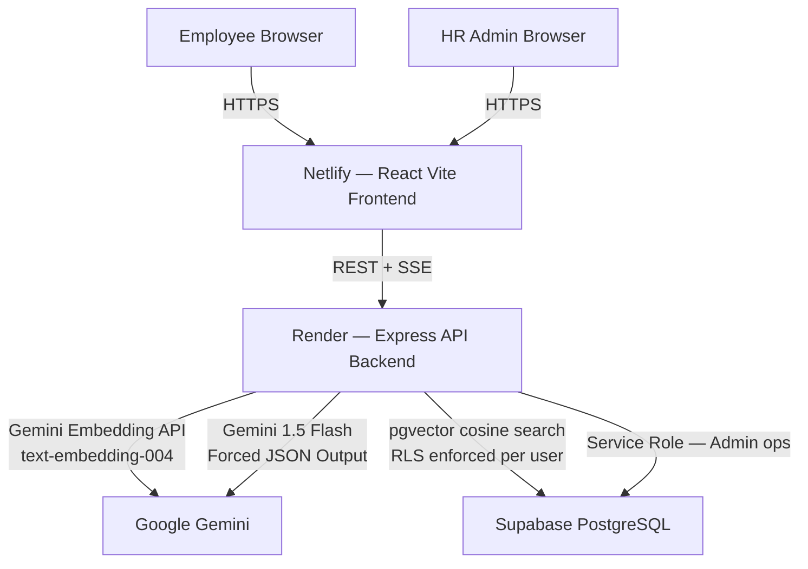

# AI-Powered HR Policy Assistant

> A secure, full-stack Generative AI application enabling employees to ask workplace policy questions and receive Gemini-grounded answers. Built with React + Vite, Node.js + Express, Supabase pgvector, and Gemini 1.5 Flash.

---

## Architecture



## Key Features

- 🤖 **RAG Pipeline** — Policy text is chunked (500 tokens), embedded with Gemini `text-embedding-004`, and stored as 768-dim vectors in Supabase pgvector
- 🔒 **Zero Hallucination** — Gemini 1.5 Flash answers exclusively from retrieved policy chunks. Forced `application/json` response schema
- 📡 **Real-time Streaming** — AI responses stream to the browser via Server-Sent Events (SSE)
- 🛡️ **RLS Security** — Row Level Security enforced on `policy_chunks`; vector search runs under the user's RLS context
- 📋 **Full Audit Trail** — Every interaction stores exact cited chunk IDs; HR admins can replay any answer with its source chunks
- ⚠️ **Auto Escalation** — Gemini returns `requires_escalation: true` when it cannot answer; UI shows escalation banner

---

## Tech Stack

| Layer | Technology |
|---|---|
| Frontend | React 18 + Vite + Tailwind CSS |
| UI Components | shadcn/ui + Radix UI + Lucide Icons |
| Routing | React Router v6 |
| HTTP Client | Axios + native Fetch (SSE) |
| Backend | Node.js + Express.js |
| Validation | Zod (strict runtime types) |
| Authentication | JWT + bcryptjs |
| AI Generation | Google Gemini 1.5 Flash |
| Embeddings | Google text-embedding-004 (768-dim) |
| Vector DB | Supabase PostgreSQL + pgvector |
| Frontend Host | Netlify |
| Backend Host | Render |

---

## Local Setup

### Prerequisites
- Node.js ≥ 18
- A Supabase project with pgvector enabled
- A Google AI Studio API key

### 1. Clone & Install

```bash
git clone <your-repo-url>
cd hr-policy-assistant

# Backend
cd backend
npm install
cp .env.example .env
# Fill in .env with your real keys

# Frontend
cd ../frontend
npm install
cp .env.example .env.local
# Set VITE_API_URL=http://localhost:5000
```

### 2. Database Setup

Run the migration in your Supabase SQL Editor:

```bash
# Copy contents of supabase/migrations/001_init.sql
# Paste & run in Supabase Dashboard → SQL Editor
```

This creates all tables, enables pgvector, sets RLS policies, and registers the `match_policy_chunks` RPC function.

### 3. Run Locally

```bash
# Terminal 1 — Backend (port 5000)
cd backend && npm run dev

# Terminal 2 — Frontend (port 5173)
cd frontend && npm run dev
```

Open: http://localhost:5173

---

## Environment Variables

### `backend/.env`
```env
PORT=5000
NODE_ENV=development
SUPABASE_URL=your_supabase_project_url
SUPABASE_ANON_KEY=your_supabase_anon_key
SUPABASE_SERVICE_KEY=your_supabase_service_role_key
JWT_SECRET=your_jwt_secret
JWT_EXPIRES_IN=7d
GEMINI_API_KEY=your_gemini_api_key
FRONTEND_URL=http://localhost:5173
```

### `frontend/.env.local`
```env
VITE_API_URL=http://localhost:5000
```

---

## API Reference

| Method | Endpoint | Auth | Description |
|---|---|---|---|
| POST | `/api/auth/register` | Public | Register new user |
| POST | `/api/auth/login` | Public | Login + receive JWT |
| POST | `/api/policies/ingest` | hr_admin | Chunk + embed + store policy |
| GET | `/api/policies` | hr_admin | List all policies |
| POST | `/api/chat/ask` | employee | RAG query → SSE stream |
| GET | `/api/chat/history` | employee | Past 50 interactions |
| GET | `/api/interactions` | hr_admin | Paginated audit log |
| GET | `/api/interactions/:id/trace` | hr_admin | Exact cited chunks for an interaction |
| GET | `/health` | Public | Health check |

---

## Gemini AI Integration

### Embedding (Ingestion)
```
Policy Text → chunk(500 tokens) → Gemini text-embedding-004 → 768-dim vector → pgvector
```

### RAG Query Flow
```
User Question
  → Gemini text-embedding-004 (embed query)
  → pgvector cosine search (top-5 chunks, under RLS)
  → Assemble Master Prompt:
      SYSTEM: "You are a strict HR Policy Assistant..."
      <CONTEXT> [chunk_id]: chunk_text ... </CONTEXT>
      USER: question
  → Gemini 1.5 Flash (response_mime_type: "application/json")
  → Parse: { answer, citations[], requires_escalation }
  → SSE stream answer to browser
  → Persist interaction + cited_chunk_ids to DB
```

### Forced JSON Output Schema
```json
{
  "answer": "Markdown-formatted response string",
  "citations": ["chunk_uuid_1", "chunk_uuid_2"],
  "requires_escalation": false
}
```

---

## Deployment

### Frontend → Netlify
1. Connect GitHub repo → select `frontend/` as root directory
2. Build command: `npm run build`
3. Publish directory: `dist`
4. Add env variable: `VITE_API_URL=<your-render-backend-url>`

### Backend → Render
1. New Web Service → connect GitHub → select `backend/` root
2. Start command: `npm start`
3. Add all env variables from `backend/.env.example`

### Database → Supabase
1. Run `supabase/migrations/001_init.sql` in SQL Editor
2. Verify pgvector is enabled
3. Verify RLS is enabled on all tables

---

## Database Schema

See [`supabase/migrations/001_init.sql`](./supabase/migrations/001_init.sql) for the full schema.

| Table | Description |
|---|---|
| `users` | Employees and HR admins with bcrypt passwords |
| `policies` | Policy documents with categories |
| `policy_versions` | Versioned policy releases with access levels |
| `policy_chunks` | 500-token text segments with 768-dim embeddings |
| `interactions` | All AI queries with responses and cited chunk IDs |

---

## Security

- JWT authentication on all protected routes
- bcrypt password hashing (12 rounds)
- Zod strict input validation on all endpoints
- Row Level Security (RLS) on all Supabase tables
- Vector search runs under user's RLS context (SECURITY INVOKER)
- Rate limiting: 10 req/min on chat endpoint
- GEMINI_API_KEY never exposed to frontend (Vite env isolation)
- helmet + CORS on all Express routes
